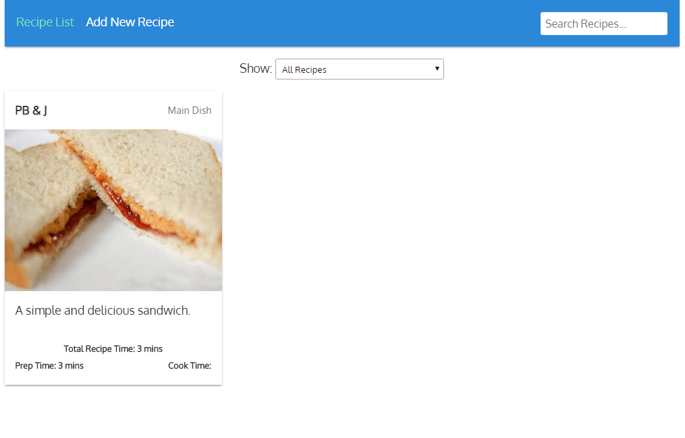

# recipes

A Vue.js SPA to keep track of recipes

[](https://travis-ci.org/kiswa/recipes) [](https://www.codacy.com/app/kiswa-com/recipes?utm_source=github.com&amp;utm_medium=referral&amp;utm_content=kiswa/recipes&amp;utm_campaign=Badge_Grade)

Here's an example of the searchable, filterable, recipes list page (the default route):



And this is what it looks like when you open a recipe:


And of course, it's responsive so it looks nice on any screen:


## Setup

```bash
# Install dependencies for the Vue app and the API.
npm i && cd api && npm i && cd ../

# Build for production
npm run build
```

Once those commands are run, there will be a `dist` directory with the app and API files. Copy these files to the web server location of your choice.

### Run The Backend

For everything to work, the backend must be running on Node. To start it (and have it kept up), navigate to the `api` directory and execute `npm start &`.

## NPM Scripts

``` bash
# install dependencies
npm install

# serve with hot reload at localhost:8080 and API at localhost:3000
npm start

# build for production with minification
npm run build

# build for production and view the bundle analyzer report
npm run build --report

# run unit tests
npm run unit

# run e2e tests
npm run e2e

# run all tests
npm test
```
